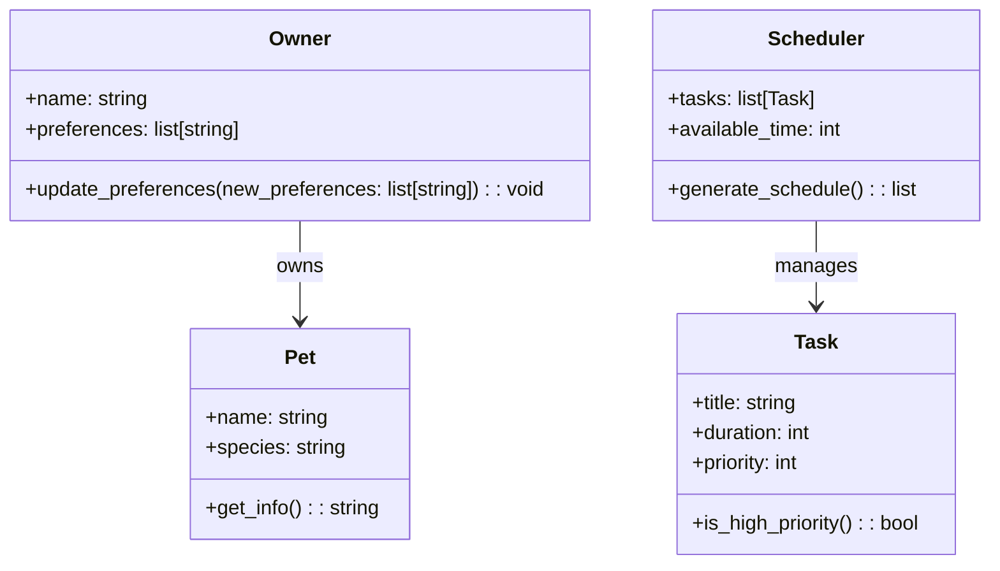

```mermaid
classDiagram
    class Pet {
        +name: string
        +species: string
        +get_info(): string
    }
    class Owner {
        +name: string
        +preferences: list[string]
        +update_preferences(new_preferences: list[string]): void
    }
    class Task {
        +title: string
        +duration: int
        +priority: int
        +is_high_priority(): bool
    }
    class Scheduler {
        +tasks: list[Task]
        +available_time: int
        +generate_schedule(): list
    }

    Owner --> Pet : owns
    Scheduler --> Task : manages
```