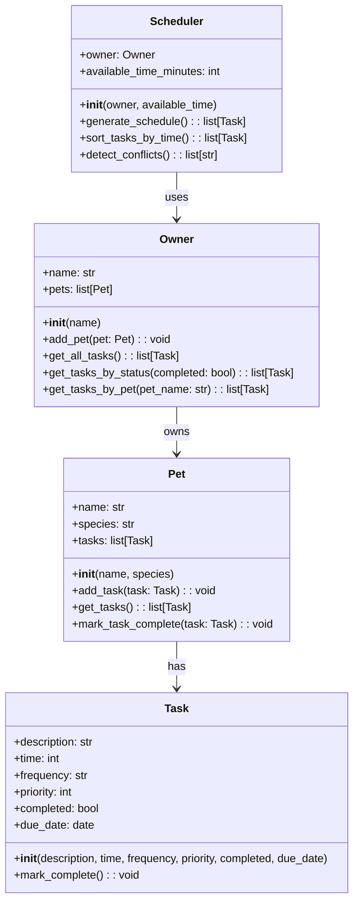

```mermaid
classDiagram
    class Task {
        +description: str
        +time: int
        +frequency: str
        +priority: int
        +completed: bool
        +due_date: date
        +__init__(description, time, frequency, priority, completed, due_date)
        +mark_complete(): void
    }
    class Pet {
        +name: str
        +species: str
        +tasks: list[Task]
        +__init__(name, species)
        +add_task(task: Task): void
        +get_tasks(): list[Task]
        +mark_task_complete(task: Task): void
    }
    class Owner {
        +name: str
        +pets: list[Pet]
        +__init__(name)
        +add_pet(pet: Pet): void
        +get_all_tasks(): list[Task]
        +get_tasks_by_status(completed: bool): list[Task]
        +get_tasks_by_pet(pet_name: str): list[Task]
    }
    class Scheduler {
        +owner: Owner
        +available_time_minutes: int
        +__init__(owner, available_time)
        +generate_schedule(): list[Task]
        +sort_tasks_by_time(): list[Task]
        +detect_conflicts(): list[str]
    }

    Owner --> Pet : owns
    Pet --> Task : has
    Scheduler --> Owner : uses
```